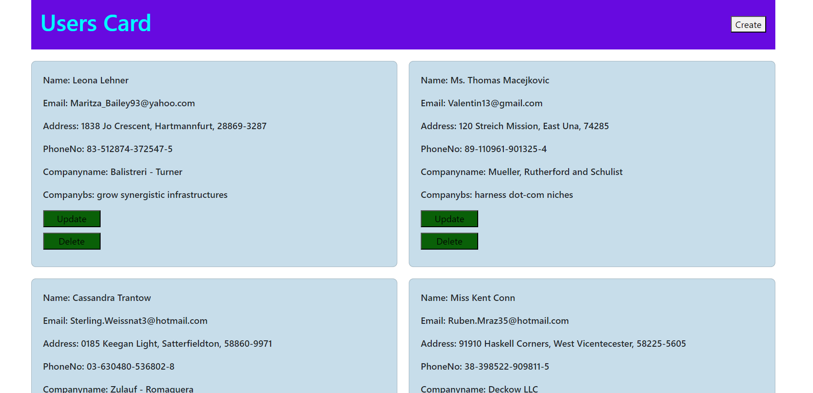

### React Axios Task

**Task Description**

 - Create a React App that allows for CRUD
  operations with user data using React and Axios fetch to interact with a mock API.

 - Mock API URL : https://jsonplaceholder.typicode.com/users

**Requirements:**

 - Display all the existing API data in UI using Axios.

 - Users should be able to perform CRUD operations on user data, including adding, editing, and deleting user records.
 
 - The user data should be stored in a mock API that can be accessed using Axios fetch.
 
 -  The UI should have a clean and responsive design that is easy to use and navigate.

  
**Deliverables:**

 - A working React application that meets the above requirements.
 
 - The application should be well-documented, including code comments and a README file that describes how to run the application.
 
 - The code should be submitted in a Git repository, with a clear commit history that demonstrates the development process.

 **Description**
   
   * In [Index.html](./index.html)
      
      - This is an HTML document that sets up a basic web page with React and Bootstrap, including a root element for the React application and scripts to load Bootstrap and the React application.
   
   * In [App.jsx](/src/App.jsx) 
     
      - **React Router Integration**: The code snippet demonstrates the integration of React Router using the `react-router-dom` package. It imports `RouterProvider` and `createBrowserRouter` from `react-router-dom`. `RouterProvider` is used to provide the router context to the application, and `createBrowserRouter` is used to create a browser router instance.

      - **Route Configuration**: Within the `App` component, the `createBrowserRouter` function is called to configure the router. It sets up a single route configuration object:
          - **Path Configuration**: The route is configured with a `path` of `/`, indicating that this route will match the root URL.
          - **Element Definition**: The `element` property specifies that when the root URL is accessed, the `<Users />` component should be rendered.
          - **Loader Function**: Additionally, a `loader` function (`usersLoader`) is imported and assigned to the `loader` property. This function likely handles any asynchronous loading or data fetching needed before rendering the `<Users />` component.

      - Overall, the code sets up a basic React application with a single route (`/`) that renders the `Users` component and specifies a loader function for any asynchronous data loading associated with that route.

    
   * In [App.css](/src/App.css)

      - CSS styles defining a grid-based card layout, centered text alignment with aqua color, a flexible navbar with purple background, and a fixed-position form container with a light blue form styled for a web page.

   * In [Users.jsx](/src/pages/Users.jsx)

      - **Data Fetching and State Initialization**: The `loader` function fetches user data from a mock API using Axios and returns it to the component. The `Users` component initializes state with this data using `useState`, storing the users in the `users` state variable.
      
      - **State Management Functions**: The component includes functions to handle adding, updating, and deleting users:
          - `handleAddUser` adds a new user to the state.
          - `handleUpdateUsers` updates an existing user’s details.
         - `handleDeleteUser` removes a user from the state.

      - **Form Visibility Toggle**: The component manages the visibility of the form with `isFormVisible`, toggled by the `toggleFormVisibility` function. A button in the navbar shows or hides the form based on its current state.

      - **Rendering User Cards**: The component maps over the `users` array to render individual user cards, displaying user details such as name, email, address, phone number, and company information. Each card includes `PutUsers` and `DeleteUser` components for updating and deleting users.

      - **Conditional Form Rendering**: When `isFormVisible` is `true`, the component renders the `CreateUsers` form inside a modal (`div.form-container`). This form is used to add new users to the list.

   * In [putUsers.jsx](/src/pages/PutUsers.jsx) 

      - **State Management**: 
          
          - The component initializes multiple state variables using the `useState` hook to manage the updated values for various user attributes (`updatedName`, `updatedEmail`, `updatedAddress`, `updatedCity`, `updatedZipcode`, `updatedPhoneNo`, `updatedCompany`, `updatedCompanybs`).
          - It also manages the visibility of the update form (`showForm`) using another state variable (`setShowForm`).

      - **Toggle Form Visibility**: 
         
          - The `toggleForm` function toggles the visibility of the update form when the "Update" button is clicked. It updates the `showForm` state to show or hide the form overlay.

      - **Form Submission**: 
      
          - When the user submits the form (`onSubmit={updatedbox}`), the `updatedbox` function is called. It prevents the default form submission behavior (`event.preventDefault()`).
          - Constructs an `updatedUser` object with the updated values from the form fields.
          - Uses Axios to send a PUT request to update the user data on a mock API endpoint (`https://66670030a2f8516ff7a5dea2.mockapi.io/Users/${user.id}`).
          - Upon successful update, it calls `onUpdateUser` (if provided) with the updated user data received from the API response.
          - Finally, it hides the form overlay by setting `showForm` to `false`.

      - **Input Change Handlers**: 
        
          - Provides separate change handler functions (`handleNameChange`, `handleEmailChange`, etc.) for each input field. These handlers update the respective state variables (`updatedName`, `updatedEmail`, etc.) with the new input values as the user types.

      - **User Interface**: 
         
          - Renders an "Update" button (`<button onClick={toggleForm} className="update-button">Update</button>`) to toggle the visibility of the update form.
          - When `showForm` is `true`, it displays the update form inside a styled overlay (`
`) and a form container (`
`). Each input field corresponds to a user attribute (name, email, address, etc.), and a "Submit" button allows the user to submit their changes.

   * In [putUsers.css](/src/pages/PutUsers.css) 

      - Styling for an update button with dark green background and a form overlay/container with light blue background, centered positioning, and reduced padding/margins for compact display in the `PutUsers` component.

   * In [CreateUsers.jsx](/src/pages/CreateUsers.jsx) 

      - **State Management**: 
          
          - Utilizes `useState` to manage local state variables for each input field (`createName`, `createEmail`, `createAddress`, `createCity`, `createZipcode`, `createPhoneNo`, `createCompany`, `createCompanybs`) to capture user input for creating a new user.

      - **Form Submission**: 
          
          - Implements `createbox` function to handle form submission (`onSubmit={createbox}`). Prevents default form submission behavior (`e.preventDefault()`) and constructs a `newUser` object with input values.
          - Uses Axios to send a POST request to a mock API (`https://66670030a2f8516ff7a5dea2.mockapi.io/Users`) with the `newUser` data.
          - Upon successful creation (`response.data`), invokes `onAddUser` callback with the newly created user's data, clears input fields, and displays a success message.

      - **Input Field Handlers**: 
          
          - Provides individual `onChange` handlers (`setCreateName`, `setCreateEmail`, etc.) for each input field to update their respective state variables (`createName`, `createEmail`, etc.) as the user types.

      - **Form Structure**: 
          
          - Renders a form (`<form>`) with labels and input fields for user details (`Name`, `Email`, `Streetaddress`, `City`, `Zipcode`, `PhoneNo`, `Companyname`, `Companybs`).
          - Each input field is connected to its corresponding state variable and updates dynamically as the user interacts with the form.

      - **Error Handling**: 
          
          - Implements error handling with try-catch block to log errors to the console and display an alert message to the user in case of a failed API request (`catch (error)`).

   * In [DeleteUsers.jsx](/src/pages/DeleteUser.jsx)  

      - **State Management**: 
          
          - Uses `useState` hook to manage the `loading` state, which tracks whether a delete operation is in progress (`loading` is `true`) or not (`loading` is `false`).

      - **Delete Operation**: 
          
          - Defines `handleDelete` function, triggered when the "Delete" button is clicked (`onClick={handleDelete}`). It sets `loading` to `true` to indicate that the deletion process has started.
          - Sends a DELETE request using Axios to a mock API endpoint (`https://66670030a2f8516ff7a5dea2.mockapi.io/Users/${userId}`) to delete the user with the specified `userId`.
          - Upon successful deletion, calls `onDeleteUser(userId)` to notify the parent component about the deletion and displays an alert message notifying the user of successful deletion.
          - Handles errors with a try-catch block, logging errors to the console (`console.error`) and displaying an alert message to inform the user of the failure.

      - **Button UI**: 
          
          - Renders a button styled with the class `update-button` from `PutUsers.css` (`<button className="update-button">`). The button label dynamically changes based on the `loading` state:
          - When `loading` is `true`, displays "Deleting..." to indicate the deletion process is ongoing.
          - When `loading` is `false`, displays "Delete" to prompt the user to initiate the deletion process.

      - **Disabled State**: 
          
          - Uses the `disabled` attribute (`disabled={loading}`) on the button to prevent users from clicking the "Delete" button while a deletion operation is in progress (`loading` is `true`), ensuring that the user doesn't trigger multiple delete requests unintentionally.

      - **User Feedback**: 
   
          - Provides clear and immediate feedback to the user through the button label ("Deleting..." or "Delete") and alert messages (`alert()`) upon successful deletion or error, enhancing the user experience by keeping them informed about the status of their action.

 **Steps to run this code:** 
  
  1. Set up a React development environment on your local machine if you haven't already. You can do this by installing Node.js and npm, and then using Create React App or setting up a React project manually.

  2. Create the necessary file structure for your project, including the `src` folder for your React components and other source files.

  3. Copy the provided React components and CSS styles into your project files. Ensure that the file paths and imports are correctly set up.

  4. Install any dependencies required by the project, such as `"react": "^18.2.0"` and ` "react-dom": "^18.2.0"` and `"react-router-dom": "^6.23.1"`and `npm install axios` by running `npm install` in your project directory.

  5. Once everything is set up, you can start your development server by running `npm run dev` in your project directory. This command will compile your React code and start a development server, typically running on `http://localhost:5173/`, where you can view your application in a web browser.

  6. If you're using any external resources or APIs, make sure they are accessible and correctly configured in your code.

  7. Finally, open your web browser and navigate to `http://localhost:5173/` (or the appropriate address if your development server is running on a different port) to see your React application in action.

 Remember to make any necessary adjustments to fit your specific project setup, such as configuring routes, managing state, and connecting to backend services if needed.

  **Output:**
       
   

**future enhancements:**
    
    Integrate pagination and filtering options to manage large datasets more efficiently.

    Implement role-based access control (RBAC) to restrict CRUD operations based on user permissions.
